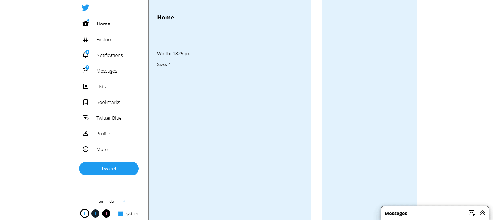

# PowerApps-ESPC23

In this workshop, we will dive deep into the best practices for designing, building, and optimizing Power Apps applications, with a strong focus on accessibility. By the end of the workshop, you will have a solid understanding of how to create accessible Power Apps applications and improve your existing apps.

## Agenda

1. Choosing the right data sources for your apps
2. Good coding practices
3. How to create reusable components - or use our [component library](https://github.com/pnp/powerapps-designtoolkit)
4. Intro to accessibility and why you need to take care
5. How to make apps accessible by design
6. How to measure accessibility
7. Using visual hierarchy and layouts to make your applications more accessible and comprehensible

## Prerequisites

From a technical standpoint we will be building a normal Canvas App without Premium features. So there is no requirement for paid licenses.

To follow this tutorial you should have build a few Canvas Apps and should be familiar with the main building blocks like galleries, buttons, etc.

## Coding exercises

Throughout the workshop, we will be rebuilding the X frontpage in Power App Canvas Apps as an example to illustrate the concepts we discuss.

Click on the chapters to jump to the respective exercises

1. [create a menu](documentation/1_menu.md)
2. [make a menu component](documentation/2_component.md)
3. [add accessibility features](documentation/3_accessibility.md)
4. [make it multilingual](documentation/4_multilingual.md)
5. [create a responsive screen](documentation/5_responsive.md)

The finished version will look something like this:

While you should try to build everything on your own, this repository will assist you in building the app, when you are stuck.
Furthermore there are side quests you can follow if you already finished the main tasks. The side quests are not discussed on this page, but the solution can be found in the reference app.

You can also download the finished msapp-file as a reference in the [Download-folder](downloads)
